  

  

## GitHub Stats

  
  

  

## Contributions

  

---

## Identity

CSE student exploring:
- Artificial Intelligence & Machine Learning
- Robotics & Embedded Systems
- Competitive Programming
- System Design & Engineering Thinking
- Game Development

---

## Current Focus

-  Autonomous systems (robotics + control)
-  Machine learning fundamentals
-  Competitive programming and DSA
-  Building modern web interfaces
-  learning game development basics

---

  

---

## Tech Stack

| Area | Technologies |
| --- | --- |
| Languages | C · C++ · Python · JavaScript · TypeScript |
| Web | React · HTML5 · CSS3 |
| Robotics & Embedded | Arduino · Sensors · Feedback Control |
| Tools & Platforms | Git · GitHub · Linux · VS Code |

---

## Connect

  
  &nbsp;&nbsp;
  
  &nbsp;&nbsp;
  

